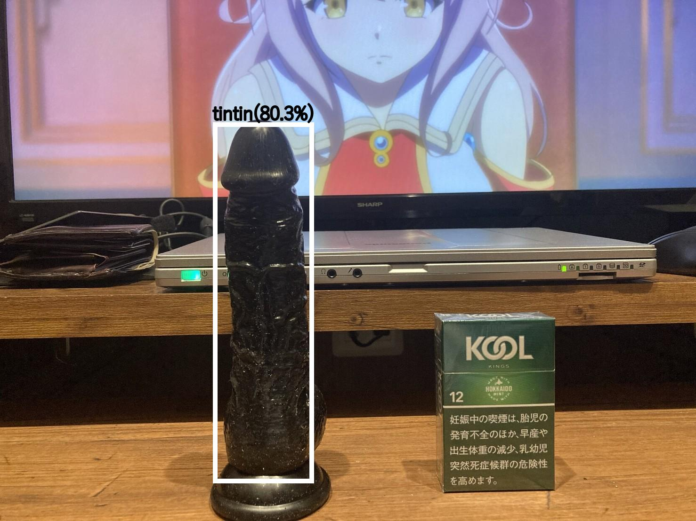

# tintinDetector

画像中のtintinを検出するプログラム

## Installation
```
git clone https://github.com/Heislandmine/tintinDetector
cd tintinDetector
```
```
pip install -r .\requirements.txt
```

## Run demonstration
```
python demo.py --input .\data\ --output results
```

**--input** オプションで指定したディレクトリに格納されている画像に対して推論が実行されます。

**--output** オプションで指定したディレクトリに結果が格納されます。

デモの実行結果

